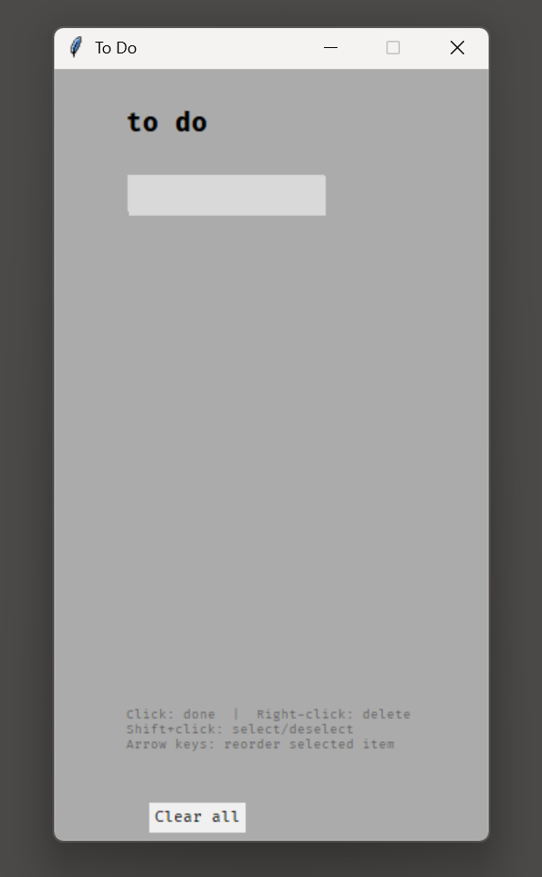
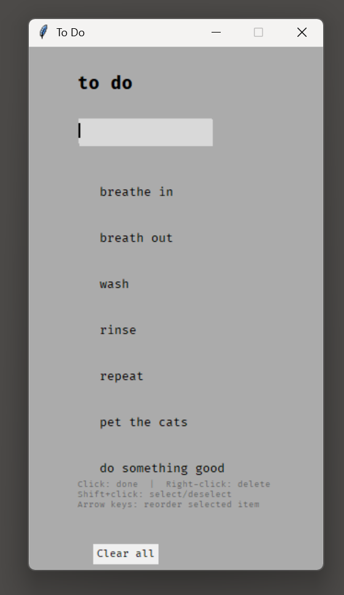

# tk-todo

A minimal to-do app built with Python and Tkinter.

The UI was designed in [Figma](https://www.figma.com/) and converted to Tkinter code using [Tkinter Designer](https://github.com/ParthJadhav/Tkinter-Designer), then customized from there.

<p align="center">
  
  &nbsp;&nbsp;
  
</p>

## Requirements

- Python 3.10+
- Tkinter (included with standard Python distributions)

## Quick Start

```bash
python app.py
```

## Usage

| Action | Effect |
|---|---|
| Type + Enter | Add a new item |
| Click an item | Toggle done (strikethrough) |
| Right-click an item | Delete it |
| Shift+click an item | Select/deselect for reordering |
| Arrow keys | Move the selected item up/down |
| Clear all button | Remove all items |
